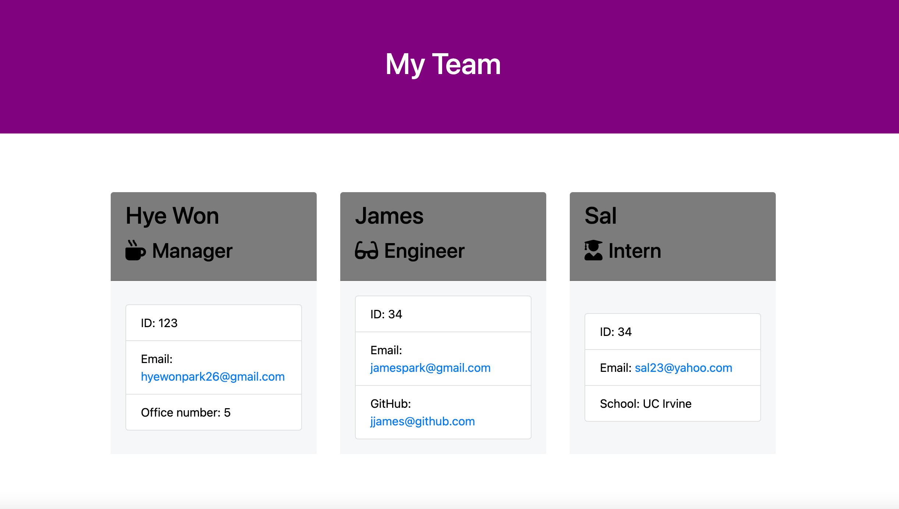

# 
  
# Team Profile Generator 

## Description

This team generator command line application will prompt user for information about the team manager and info about other team members (engineers and interns). After user completes building the team, the application will create a HTML file that displays a nicely formatted team roster based on the info provided by the user. 

## Table of Contents
* [Installation](#installation)
* [Usage](#usage)
* [Contributing](#contributing)
* [Tests](#tests)
* [Questions](#questions)

## Installation

To install necessary dependencies, run the following commands: 

```
npm i
npm i inquirer
npm i express
npm install --save-dev jest
```

## Usage

Simply clone down and type 'node app.js' into terminal. 
User will then be prompted with a series of questions about team members.  
After answering all the questions, a new HTML file containing all the information about team members should appear on the output folder.

## License

This project is licensed under the terms of the APACH_2.0.

## Contributing

This project is considered finished, but if you'd like, you can submit a pull request. You can also email me with details of your pull request.

## Tests

To run tests, run the following command:

```
1. install jest with 'npm install --save-dev jest' on terminal

2. 'npm run test' in terminal
```

## Questions

If you have any questions about the repo, contact me directly at hyewonpark26@gmail.com.
You can find more of my other projects at [hyep2]. (https://github.com/hyep2/).


